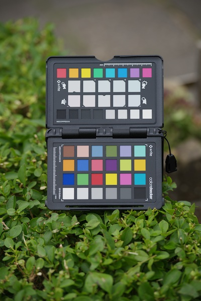

# LibRaw

[](https://jonathanBieler.github.io/LibRaw.jl/dev)

[](https://github.com/jonathanBieler/LibRaw.jl/actions/workflows/CI.yml?query=branch%3Amain)
[](https://codecov.io/gh/jonathanBieler/LibRaw.jl)

[](https://www.repostatus.org/#wip)

Bindings for the [LibRaw](https://www.libraw.org/) library. The purpose of this package to read
raw file and access the data, and apply some basic post-processing (applying coefficients and color matrices, demosaicing). Colors.jl
and Images.jl could be used for further post-processing.

Bindings were automatically generated using [Clang.jl](https://github.com/JuliaInterop/Clang.jl), see `gen/generator.jl`.

Please open an issue if a functionality is missing or broken.



## Known issues

- Margins are not taken into account
- Only RGBG Bayer pattern is supported

## Example

See examples/process_raw_files.jl for a more complete example.

```julia
raw_img = LibRaw.RawImage("data/ccp2.nef")

@assert LibRaw.color_description(raw_img) == "RGBG"
img = LibRaw.demoisaic(LibRaw.BayerAverage(), raw_img)#h x w x 4 Array

# apply white balance as shot
LibRaw.apply_multipliers!(img, LibRaw.camera_multipliers(raw_img))
```
